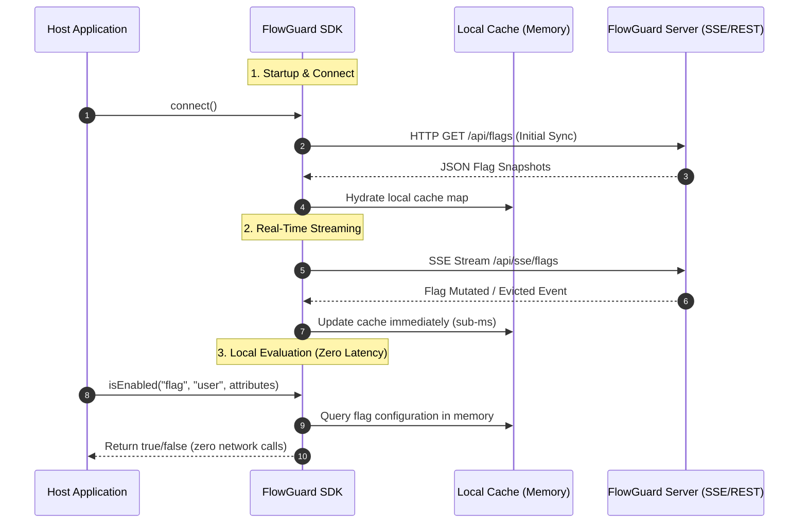

# FlowGuard Java SDK

[](https://github.com/joaogabriel43/flowguard-sdk/actions/workflows/ci.yml)
[](https://github.com/joaogabriel43/flowguard-sdk/packages)
[](https://openjdk.org)
[](LICENSE)

**Java SDK for FlowGuard — local flag evaluation, zero-latency, automatic fallback and real-time updates via SSE**

---

## Installation

Add the following Maven dependency to your `pom.xml`:

```xml
<dependency>
    <groupId>com.flowguard</groupId>
    <artifactId>flowguard-sdk</artifactId>
    <version>1.0.0</version>
</dependency>
```

---

## Quick Start

### 1. Configure properties
Add the following properties to your `application.properties`:

```properties
flowguard.server-url=http://localhost:8080
flowguard.api-key=your_sdk_api_key_here
flowguard.tenant-id=your_tenant_uuid_here
flowguard.default-fallback=false
```

### 2. Ingest and call isEnabled()
Use our zero-boilerplate Spring Boot integration to inject the `FlowGuard` client and evaluate flags immediately:

```java
@Autowired
private FlowGuard flowGuard;

boolean showNewUI = flowGuard.isEnabled("new-dashboard-ui", "usr_1234");
```

### 3. Progressive Rollout & Segmentation
Evaluate flags dynamically passing user context attributes for advanced segmentation rules (e.g., matching operators or progressive percentage rollouts):

```java
Map<String, String> attributes = Map.of(
    "country", "BR",
    "tier", "enterprise",
    "device", "mobile"
);

boolean isEligible = flowGuard.isEnabled("premium-discount-banner", "usr_1234", attributes);
```

---

## How It Works

FlowGuard achieves high-performance evaluations by storing snapshots locally in memory, keeping network latency at absolute zero.



### Self-Healing & Fallbacks
If the connection to the FlowGuard Server drops, the SDK is completely self-healing:
*   Evaluations continue utilizing the **last valid in-memory snapshot** to keep your application operational without throwing exceptions.
*   If a requested flag key is missing entirely, or if the server was unreachable during the initial startup, the SDK gracefully resolves to the developer's pre-configured `default-fallback` value.

---

## Technical Highlights

*   **Sub-Millisecond Cache Queries:** Zero-latency flag resolution by running evaluations entirely against local thread-safe in-memory cache structures.
*   **Automatic Cache-aside Fallback:** Gracefully recovers flag decisions from last-known states when connections drop, preventing API timeouts.
*   **Silent Reconnection with Backoff:** Spawns a background SSE listener that silently attempts to reconnect using a randomized exponential backoff if the network drops.
*   **Thread-Safe Architecture:** Engineered using modern Java concurrency utilities (`ConcurrentHashMap`, atomic reference swaps) to support extremely high-throughput, multi-threaded workloads.
*   **Zero-Boilerplate Spring Boot Auto-configuration:** Includes native boot auto-configurations that set up, connect, and shut down client dependencies automatically.

---

## Failure Resilience Matrix

| Failure Scenario | SDK Resilience Behavior |
| :--- | :--- |
| **Server indisponível no startup** | The local cache remains empty. The SDK starts safely without blocking the host application, silently firing background retry routines and returning the configured default fallback for all evaluations. |
| **Conexão SSE cai em runtime** | The SDK continues to serve evaluations with sub-millisecond speeds using the last valid in-memory snapshot, while silently spawning a background retry listener that employs exponential backoff. |
| **Flag consultada não encontrada** | If a flag is deleted or misspelled, the SDK catches the event safely and immediately returns the developer's strict fallback parameter (`default-fallback`) without throwing NullPointerExceptions. |

---

## Cross-Reference

To manage your feature flags, progressive rollouts, multi-tenancy rules, and monitor real-time audit logs, run our central management backend server.

👉 **View core server repo:** [FlowGuard Server](https://github.com/joaogabriel43/flowguard-server)
